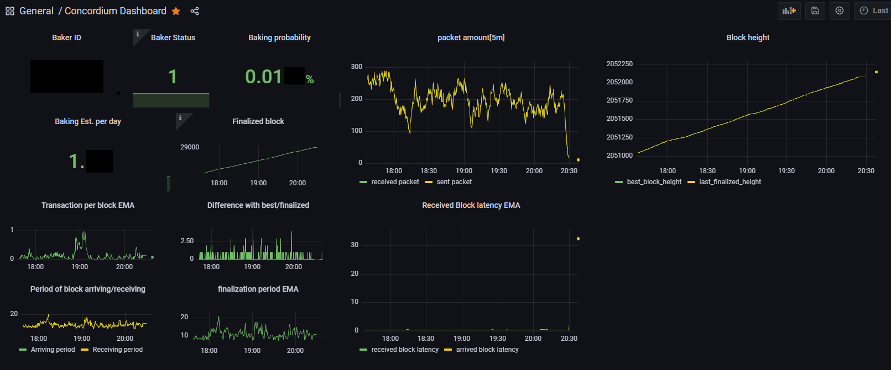

# concordium-exporter

[](https://github.com/liray-unendlich/concordium-exporter/actions/workflows/release-image.yml)

## Example

```bash
./concordium-exporter
```

It connects your concordium-node and serves HTTP API on port(9360) for prometheus, connect localhost:10000 for concordium-node gRPC server.

Other example,

ex.1: port, url, password changed

```bash
./concordium-exporter -hport 9366 -url localhost:10211 -pwd rpcadmin
```

It serves API on 9366, connect concordium-node with localhost:10211, and it uses authentication password as rpcadmin.

ex.2: docker

```bash
docker pull ghcr.io/liray-unendlich/concordium-exporter:latest
docker run -p 9360:9360 ghcr.io/liray-unendlich/concordium-exporter:latest
```

ex.3: docker-compose

```
  concordium-exporter:
    image: ghcr.io/liray-unendlich/concordium-exporter:latest
    environment:
      CCDEXPORTER_HPORT: '9999'
      CCDEXPORTER_URL: 'localhost:11111'
      CCDEXPORTER_PWD: 'rpcasssn'
    expose:
     - '9999'
```

Ofcourse, I recommend to use specific version, not latest.

## Options

There are several option for exporter.

| flag              | outline                                                   |
| ----------------- | --------------------------------------------------------- |
| -hport string     | The port listens on for HTTP requests (default "9360")    |
| -pwd string       | The password to pass concordium node (default "rpcadmin") |
| -url string       | Concordium gRPC URL (default "localhost:10000")           |
| --baker or -baker | Whether your node is baking                               |

You can use environment variable for set options.

| environment variable         |
| ---------------------------- |
| CCDEXPORTER_HPORT=\<HPORT\>  |
| CCDEXPORTER_PWD=\<PASSWORD\> |
| CCDEXPORTER_URL=\<IP:PORT\>  |
| CCDEXPORTER_BAKER=TRUE       |

## Serving Information

It serves these information.

| name                         | outline                                                                                                       |
| ---------------------------- | ------------------------------------------------------------------------------------------------------------- |
| best_block_height            | Best block number                                                                                             |
| last_finalized_block_height  | Latest finalized block number                                                                                 |
| finalization_period_inEMA    | duration per finalization[s](EMA)                                                                             |
| epoch_duration               | duration per epoch[s]                                                                                         |
| slot_duration                | duration per slot[s]                                                                                          |
| peer_total_sent_amount       | Packets your node sent to peer in Byte                                                                        |
| peer_total_receive_amount    | Packets your node received from peer in Byte                                                                  |
| block_arrive_latency_inEMA   | Latency of block arrival(EMA)                                                                                 |
| block_arrive_period_inEMA    | duration per arriving block[s](EMA)                                                                           |
| block_receive_latency_inEMA  | Latency of block receiving(EMA)                                                                               |
| block_receive_period_inEMA   | duration per receiving block[s](EMA)                                                                          |
| transactions_per_block_inEMA | Transaction per block(EMA)                                                                                    |
| baker_running                | Status of baker node (If you want to use this information, you need to execute this exporter with baker node) |
| consensus_running            | Status of node and consensus module                                                                           |
| baker_id                     | Id of baker node (If you want to use this information, you need to execute this exporter with baker node)     |

| baker_lottery_power | Probability that a baker node bake a block per block |
| estimated_baking_block_per_day | The number of blocks your baker is expected to bake per day |

## Connecting and using data

You can connect the exporter with `http://VPS-IP:hport/metrics`.

## Use grafana to monitor your exported data

You can use our example dashboard json: [HERE](concordium-dashboard.json)

Here is example screenshot:

